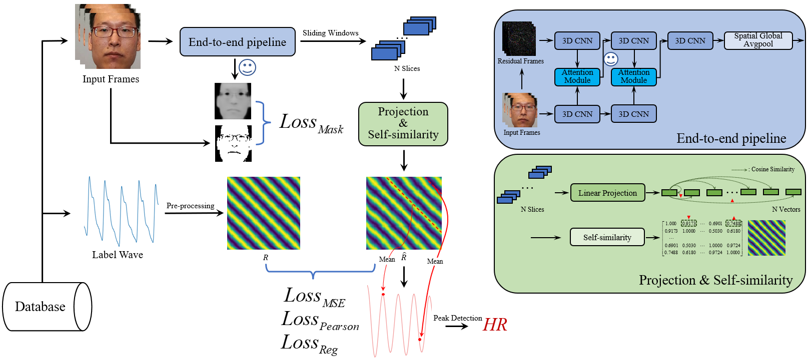

# BYHE: A Simple Framework for Boosting End-to-end Video-based Heart Rate Measurement Network
PyTorch implementation for BYHE.

<div align="center">
  
</div>

## Preparation
1. Please install `Requirements` and download the [VIPL-HR](http://vipl.ict.ac.cn/zygx/sjk/201811/t20181129_32716.html) datasets.
    ```bash
    Requirements:
    python==3.7             
    torch==1.7.1+cu110       # the later version is also OK.
    torchvision==0.8.2+cu110
    numpy==1.19.5           
    pycwt==0.3.0a22
    opencv-python==4.5.4.60  
    scipy==1.7.2
    einops==0.3.2
    dlib==19.17.99
    tqdm==4.62.3
    scikit-learn==1.0.1
    matplotlib==3.3.3
    albumentations==1.2.0
    Pillow==8.3.2
    ```
   
2. Preprocess [VIPL-HR](http://vipl.ict.ac.cn/zygx/sjk/201811/t20181129_32716.html) datasets.
   **"vipl-hr-infos"** can be found at `./data`.

    ```bash
    python VIPL_preprocess.py
        --data-path /path/to/vipl-hr/
        --infos-path ./data/vipl-hr-infos
        --frame-path /path/to/save/frame_list
        --mask-path /path/to/save/mask_list
        --wave-path /path/to/save/wave_gt
        --face-data-path /path/to/save/face_data
        --face-img-path /path/to/save/face_img    
    ```


## Training
Default hyperparameter settings based on single GPU card "Tesla v100" with 16 GB memory.
```bash
python train.py
    --frame-path /path/to/frame_list
    --mask-path /path/to/mask_list
    --wave-path /path/to/wave_gt
    --GPU-id 0
    --num-workers 4
    --batch-size 6
    --epochs 50
    --log-enable True
    --log-theme VIPL
```


## Evaluation
Pre-trained weights can be found at `./pretrained`.Test with your own data:
```bash
python test.py
    --frame-path /path/to/frame_list
    --mask-path /path/to/mask_list
    --wave-path /path/to/wave_gt
    --GPU-id 0
    --num-workers 4
    --log-enable True
    --visual-enable True
    --pretrained ./pretrained/VIPL_f1.pth
```
For quick testing:
```bash
python test.py 
    --frame-path ./data/vipl-frame/frame_list
    --mask-path ./data/vipl-frame/mask_list
    --wave-path ./data/vipl-frame/wave_gt
    --GPU-id 0 
    --num-workers 4 
    --log-enable True 
    --visual-enable 
    --pretrained ./pretrained/VIPL_f1.pth
```